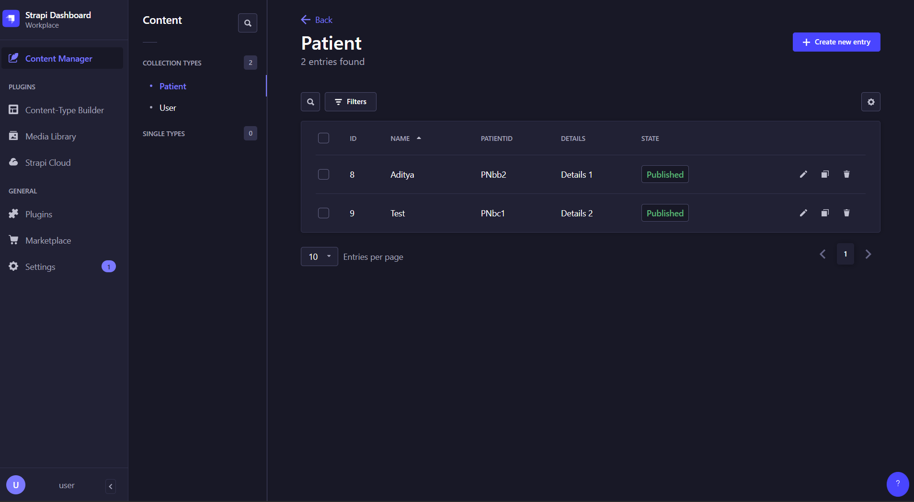
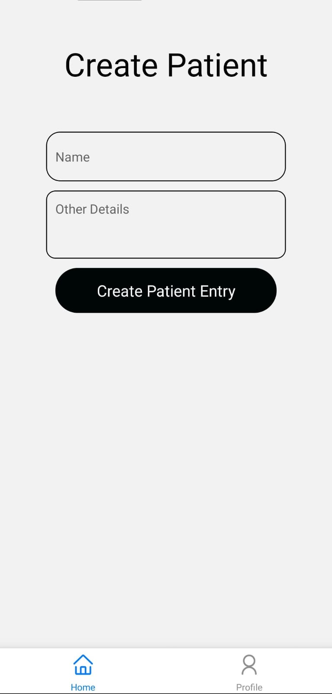
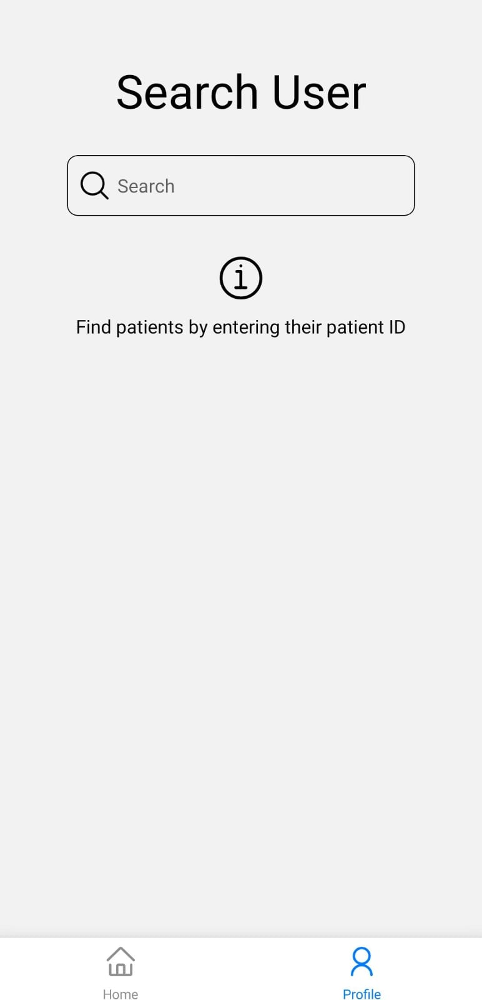
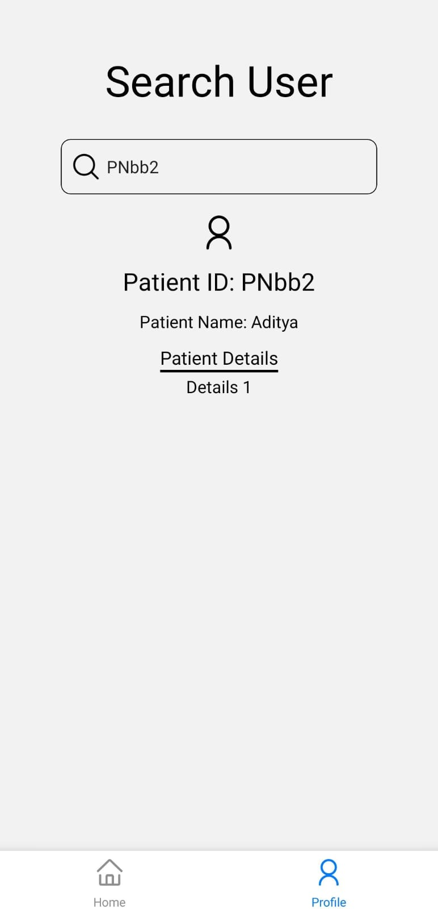

# Patient Relations Management System (Barebones)

## System Requirements

-   NodeJS installed on system
-   Ngrok CLI installed on system and an Ngrok account
-   Expo Go app installed on mobile
-   Expo account

## Setup

```sh
git clone
npm install

cd prm-backend
npm install
```

## Running

1. First start the backend Strapi API

```sh
cd prm-backend
npm start
```

Open `localhost:1337/admin`

Signup and go to `Settings > API tokens > Create new API Token` and set the token type to `Full access`

Copy the Strapi API token and paste it in the `.env` file

In another terminal, run ngrok

```sh
npx ngrok http 1337
```

Copy the forward URL and paste it in the `.env` file

2. Then, run the app

```sh
npm start
```

Open the Expo Go app, login to your account and scan the QR code to run the app natively on your mobile device

## Screenshots

1. Backend
   

2. Frontend

-   Home Page
    

-   Search Page
    
    
